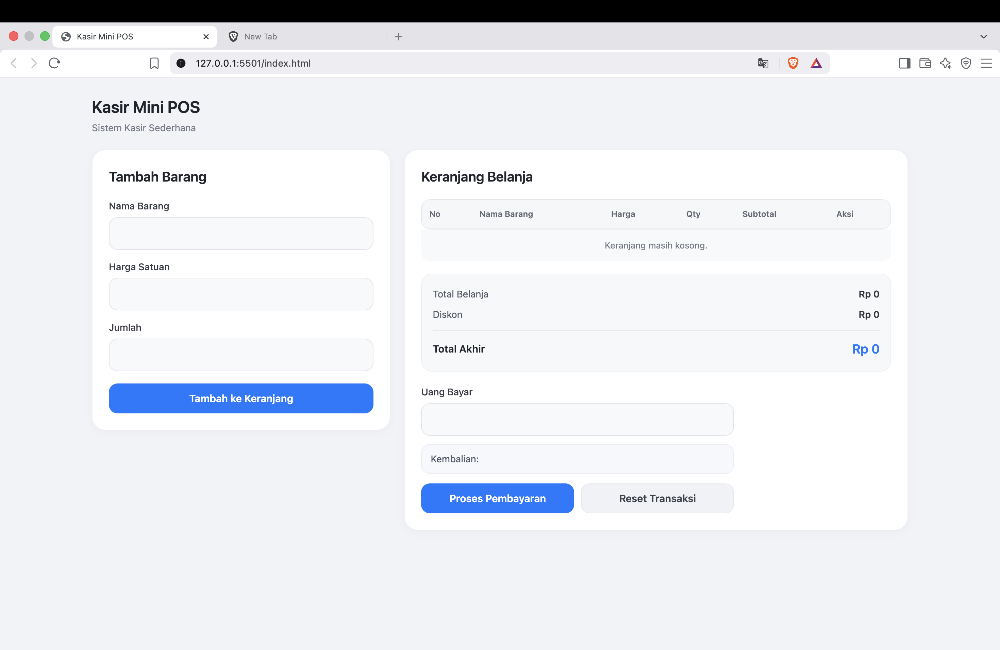
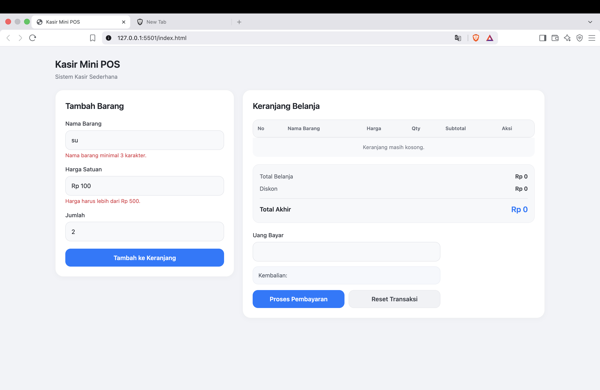
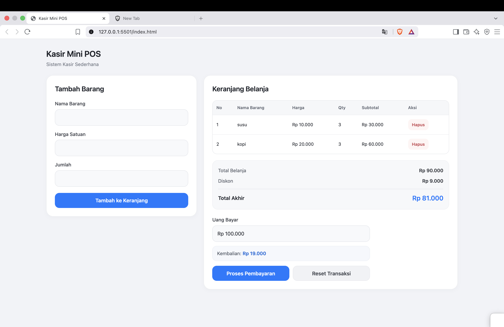

# Kasir Mini POS

## Identitas

- **Nama:** Chesya Margaretha Deto
- **NIM:** 124140098
- **Kelas Praktikum:** RB
- **Mata Kuliah:** Pengembangan Aplikasi Web

## Deskripsi

Kasir Mini POS merupakan aplikasi kasir sederhana berbasis HTML, CSS, dan JavaScript. Aplikasi ini digunakan untuk menambahkan barang ke dalam keranjang, menghitung total belanja, memberikan diskon otomatis, memproses pembayaran, serta menghitung kembalian. Data keranjang juga disimpan menggunakan localStorage sehingga data tetap tersedia ketika halaman dimuat kembali.

## Fitur

- Menambahkan barang ke keranjang
- Validasi nama barang, harga, dan quantity
- Menghitung subtotal setiap barang
- Menghitung total belanja
- Diskon otomatis 10% untuk total belanja minimal Rp50.000
- Menghitung pembayaran dan kembalian
- Menghapus barang dari keranjang
- Reset transaksi
- Penyimpanan data menggunakan localStorage
- Format harga dalam Rupiah
- Tampilan responsif

## Teknologi

- HTML5
- CSS3
- JavaScript
- localStorage
- JSON

## Cara Menjalankan

1. Download atau clone repository.
2. Buka folder `Chesya Margaretha Deto_124140098_pertemuan 1`.
3. Buka file `index.html` menggunakan browser.
4. Aplikasi siap digunakan.

## Cara Menggunakan

1. Masukkan nama barang.
2. Masukkan harga satuan.
3. Masukkan quantity.
4. Klik **Tambah ke Keranjang**.
5. Barang akan ditampilkan pada tabel keranjang.
6. Total dan diskon akan dihitung secara otomatis.
7. Masukkan jumlah uang pembayaran.
8. Klik **Proses Pembayaran** untuk melihat kembalian.
9. Gunakan tombol **Hapus** untuk menghapus barang.
10. Gunakan **Reset Transaksi** untuk memulai transaksi baru.

## Screenshot

### 1. Tampilan Utama

### 2. Validasi Input

### 3. Perhitungan Transaksi

## Penjelasan Teknis

### Validasi Input

JavaScript melakukan validasi terhadap setiap input sebelum barang ditambahkan. Nama barang harus memiliki minimal 3 karakter, harga harus lebih dari Rp500, dan quantity minimal 1.

### Keranjang dan Perhitungan

Setiap barang yang ditambahkan disimpan dalam array `keranjang`. Subtotal dihitung berdasarkan harga satuan dikalikan quantity. Selanjutnya sistem menghitung total seluruh barang.

### Diskon

Jika total belanja mencapai minimal Rp50.000, sistem memberikan diskon otomatis sebesar 10%. Total akhir dihitung dari total belanja dikurangi diskon.

### Pembayaran

Pengguna memasukkan jumlah uang pembayaran. Sistem membandingkan uang pembayaran dengan total akhir untuk menentukan apakah pembayaran kurang, pas, atau menghasilkan kembalian.

### localStorage

Data keranjang disimpan menggunakan `localStorage` dengan `JSON.stringify()` dan dibaca kembali menggunakan `JSON.parse()`. Dengan demikian, data keranjang tetap tersimpan ketika halaman dimuat kembali.

### Responsive Design

Tampilan menggunakan CSS Grid dan media query agar layout dapat menyesuaikan ukuran layar, baik pada desktop maupun perangkat dengan layar yang lebih kecil.
